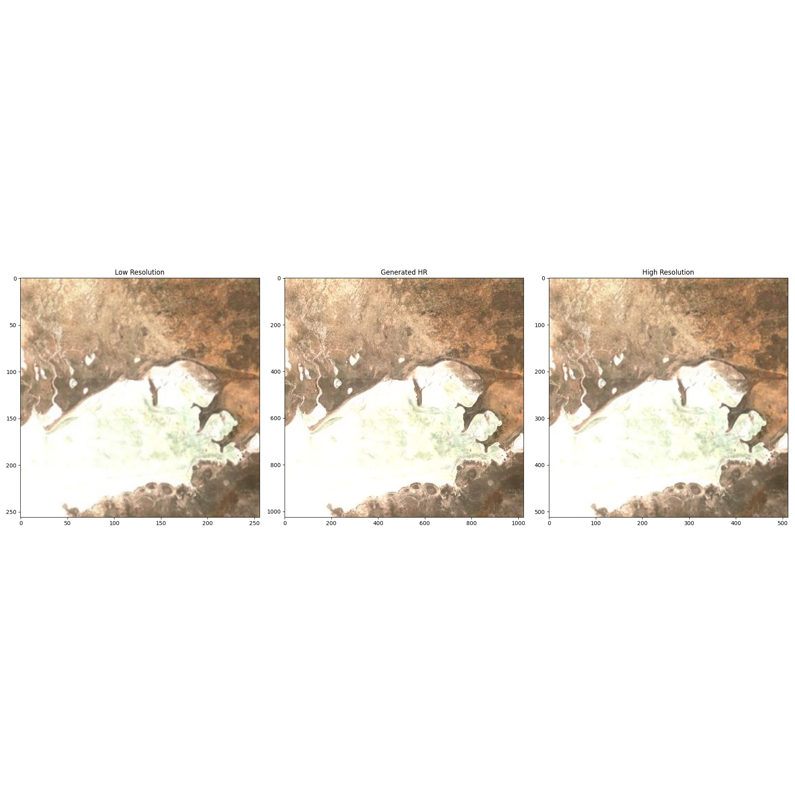
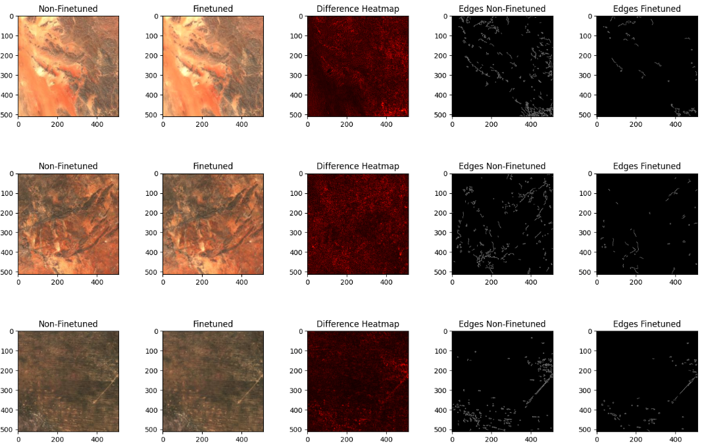

# mining_SRGANs
Super-Resolution GANs Transforming Satellite Imagery for Mining

# Super-Resolution GANs for Satellite Imagery in Mining

This project explores the application of Super-Resolution Generative Adversarial Networks (GANs) to enhance low-resolution satellite imagery of Namibia. The goal is to improve the effectiveness of downstream machine learning tasks crucial for identifying new mineral deposits in the mining industry.

## Overview

This project implements and fine-tunes the Enhanced Super-Resolution GAN (ESRGAN) to process Sentinel-2 satellite images of Namibia. The main objectives are:

1. Enhance low-resolution satellite imagery (128x128) to high-resolution (512x512)
2. Evaluate the performance using standard image super-resolution metrics
3. Fine-tune the ESRGAN model with Namibia-specific data
4. Compare the results of pre-trained and fine-tuned models

## Results

The project achieved significant improvements in image quality using both pre-trained and fine-tuned ESRGAN models. Here are the key results:

### Pre-trained ESRGAN
- Average PSNR: 30.20 dB
- Average SSIM: 0.7521

### Fine-tuned ESRGAN
- Average PSNR: 31.14 dB (3.03% improvement)
- Average SSIM: 0.8061 (11.79% improvement)

Visual comparison of results:

*Left: Low-resolution input. Center: ESRGAN output. Right: High-resolution ground truth.*

Edge detection comparison:

## Future Work

1. Expand the dataset of satellite imagery of Namibia
2. Utilize various bands from Sentinel-2, such as R60 and R10
3. Further optimize the fine-tuning process for ESRGAN, including data selection and hyperparameter tuning
4. Explore the potential of StyleGAN3 for latent space perturbation in satellite imagery enhancement

## References

1. Copernicus Browser. [Link](https://browser.dataspace.copernicus.eu/)
2. Hui, J. (2018). GAN - Super Resolution GAN (SRGAN). [Medium](https://jonathan-hui.medium.com/gan-super-resolution-gan-srgan-b471da7270ec)
3. Janiczek, J. Finetune ESRGAN. [GitHub](https://github.com/johnjaniczek/finetune_ESRGAN)
4. Satellite-Image-Deep-Learning. [GitHub](https://github.com/satellite-image-deep-learning/techniques)
5. Sinha, V. (2020). ESRGAN: Enhanced Super Resolution GAN. [Medium](https://medium.com/analytics-vidhya/esrgan-enhanced-super-resolution-gan-96a28821634)
6. Überschär, F. (2023). A Closer Look at the Code for Creating a Dataset of Satellite Images for StyleGAN Training. [Medium](https://ueberf.medium.com/a-closer-look-at-the-code-for-creating-a-dataset-of-satellite-images-for-stylegan-training-9c0e5088a303)
7. Xinntao. ESRGAN. [GitHub](https://github.com/xinntao/ESRGAN)